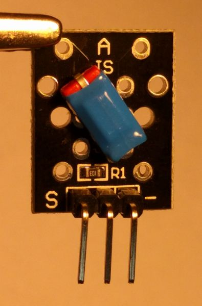

# micropython_tilt_switch_sensor

instead of using over specified accelerometers 
use a super cheap KY-020 module!!

super simple example use of tilt switch sensor on the [esp8266 port of micropython](https://micropython.org/download#esp8266)  
  I used the [lolin esp8266  D1 mini pro board](https://wiki.wemos.cc/products:d1:d1_mini_pro) and the KY-020 connected to GPIO 0.

  There is no documentation for the KY-020 so have a close look at the module,
  - "-" usually means Ground
  - "S" can mean the Signal line, so connect that to a spare GPIO, I chose GPIO 0 on the ESP8266
  - my power line wasn't labeled at all! I only had one line so it had to be power.  
  
    Although this sensor is 5V, I connected to 3V3 and it worked fine.

     When the unit is vertical, output line is low.
       when the unit is tilted; about 15 to 20 degrees, the output line is high 